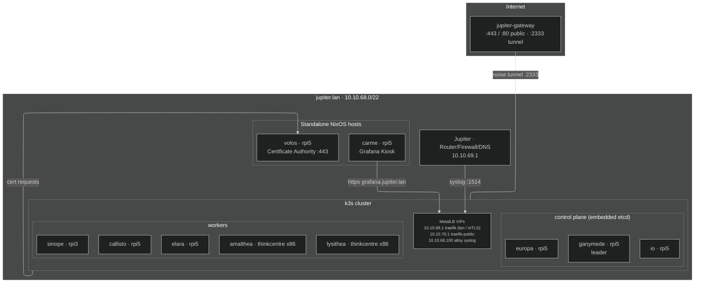
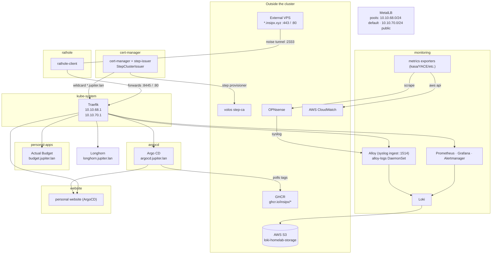

[](https://hercules-ci.com/github/insipx/jupiter/status)

# Jupiter Homelab

A few Raspberry Pi5s and thinkcentre minis all deployed with NixOS running k3s
in one flake :)


## Project structure

```text
.
├── hive/                 # Per-node deployment configurations for Colmena.
├── base/                 # Shared host configurations, including NixOS user config.
├── machine-specific/     # NixOS config specific to host machines (rpi5/rpi4/thinkcentre/etc.).
├── nixos/                # initial Raspberry Pi and x86 NixOS configurations.
├── deployments/          # where stuff deployed on the cluster goes.
├── apps/                 # app source if any, so far just kasa exporter for power metrics.
├── pkgs/                 # Any software that requires custom packaging (rathole).
├── images/               # Nix-built docker images.
├── modules/              # Extra modules/configs, so far just a quick and dirty hercules-ci agent config.
├── scripts/              # helper scripts, AWS build server script for aarch64-linux / freebsd.
└── .github/workflows/    # Github actions (mostly building docker images).
```

## Architecture

### Hosts

Everything is deployed with [colmena](https://github.com/zhaofengli/colmena)
from `hive/default.nix`. Node names are moons of Jupiter.



### Cluster workloads

Everything in the cluster is declared with
[kubenix](https://github.com/hall/kubenix) under `deployments/kubenix`, grouped
by namespace.


