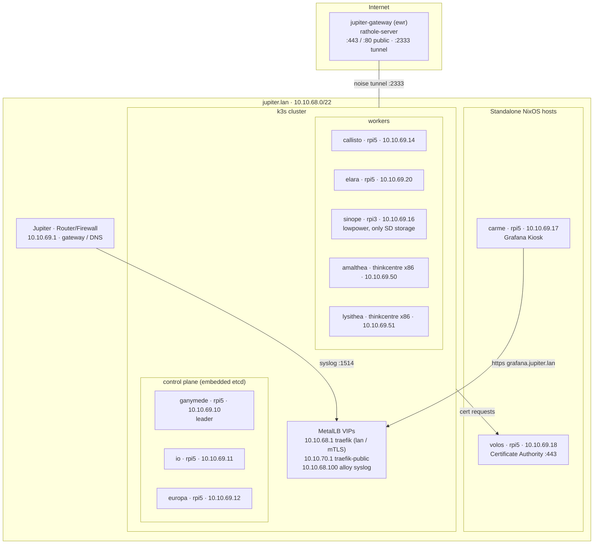
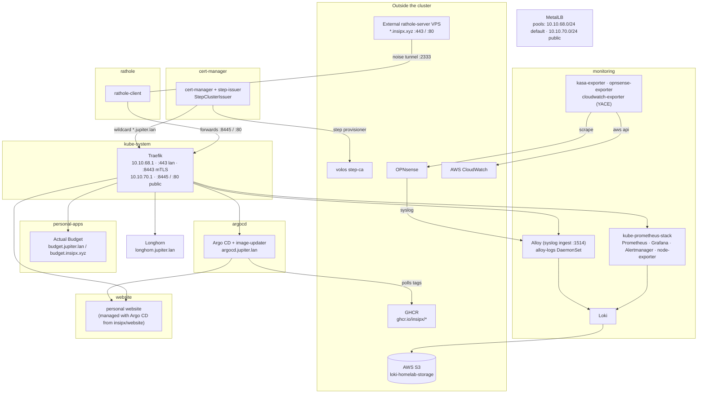

# Jupiter Homelab

A few Raspberry Pi5s and thinkcentre minis all deployed with NixOS running k3s
in one flake :)

## Architecture

### Hosts

Everything is deployed with [colmena](https://github.com/zhaofengli/colmena)
from `hive/default.nix`. Node names are moons of Jupiter.

### Cluster workloads

Everything in the cluster is declared with
[kubenix](https://github.com/hall/kubenix) under `deployments/kubenix`, grouped
by namespace. The public gateway on Fly.io lives in `deployments/fly`.

